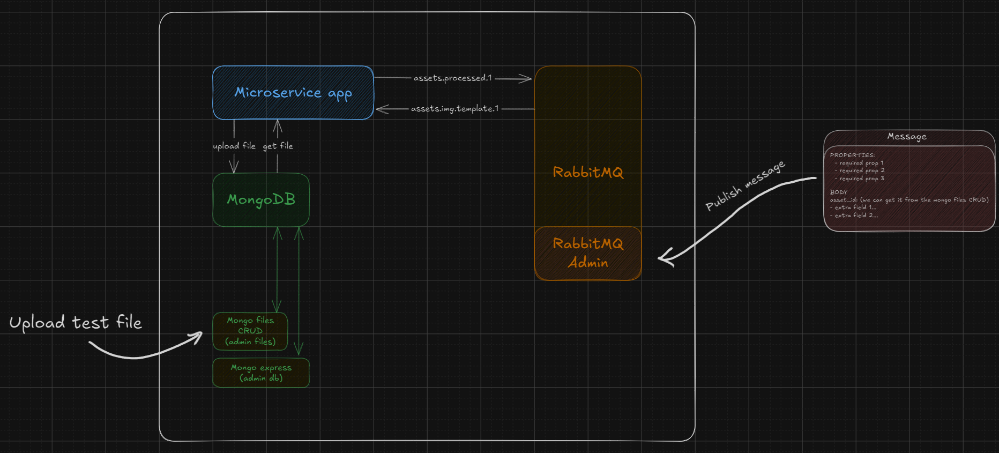

# AssetAlchemy - Microservice template for python
This is a template repo for all of the python based microservices that will be using "AssetAlchemy".

This repo is a template for the following services to work properly:
- RabbitMQ: to receive and send events
- MongoDB: to store and read asset files

# Development in Dev Containers
For development, we recommend starting this project using [Dev Containers](https://code.visualstudio.com/docs/devcontainers/containers), Dev Containers will avoid wasting our time as developers installing and checking versions of different dependencies.

### Requeriments:
* Git
* Docker
* Visual Studio code
* Dev Containers vscode extension
* Docker vscode extension

## Step by Step

### 1) Clone repo
```bash
git clone ${Repository URL to clone}
```

### 2) Open project directory in vscode

### 3) Create .env
We should create an .env file based on .env.example

### 4) Reopen project in devcontainer
To do this we should open the command palette in vscode (the default shortcut is `F1`) and type
```
>Dev Containers: Reopen in Container
``` 

### 5) Reload vscode (optional)
If all went well, the vscode git extension will most likely fail, to fix this you need to reload vscode by typing the following command into the command palette
```
>Developer: Reload Window
```

### 6) Start project
To start the project, you can start it by going into debug mode on vscode and pressing the run button in the `Run and Debug` panel, or you can type the following in the [container's console](#console)
```bash
python ./app/main.py
```
And that's it, life is easier with [Dev Containers](https://code.visualstudio.com/docs/devcontainers/containers).

### 7) Update requeriments.txt (Only in some cases)
Once you've finished your development and installed some additional dependencies, you'll need to update the `requeriments.txt' file. To do this, run the following command on the [Dev Container's console](#console).


For update dependencies used in production mode:
```bash
pip freeze > requirements.txt
```

For update dependencies including dev dependencies to the production ones
```bash
pip freeze > requirements-dev.txt
```

Note: It is the developer's responsibility to keep the `requeriments.txt' file as clean as possible, excluding dev dependencies to avoid them being installed in the production container. Every MB counts in production, it's better to have it well optimised.

# Development usage:
In our `docker-compose.yml` we will find some services that will help us with development:
- aa-microservice-template-python: This is our microservice where we will write the code. 
- mongo: The database where the files will be stored.
- mongo-express: Database administration panel. Works on http://localhost:8888 (default user & passord is `dev`).
- crud-mongo-gridfs: Database CRUD for files. Working on http://localhost:5000/
- rabbitmq: Comes with two applications. The first is the message broker and the second is the rabbitMQ admin panel on http://localhost:15672/.



## How do I receive messages in the microservice?
By default, the microservice listens for messages on the `assets.template.1` queue. If we want to test it we can send a message through the rabbitmq admin panel, for this we should go to http://localhost:15672/#/queues/%2F/assets.template.1 (if you are using a different queue please change the last part of the link) and go to the "Publish message" section, here you can publish any message you want.

In the project repo there is an `asyncapi.yaml` file which explains which format messages should follow. In the devcontainer there is an extension to have a nice preview of `asyncapi` files (asyncapi.asyncapi-preview).

See https://www.asyncapi.com/en for more details.

The microservice require an `asset_id` which should be sent in the body of the message.

## Where do I get the `asset_id` if there is no file uploaded?
Now you have everything working and if you have checked the `asyncapi.yaml` you have seen that an `asset_id` is required to apply processes to an asset, but at the moment we have no assets uploaded to our storage database.

So, how can I upload a test file to pass its `asset_id` in a message to start processing the file?

Wow! that was a very specific and big question, fortunately it has a short answer. we can upload a file via the `crud-mongo-gridfs` running on http://localhost:50000/ to start the process.

# Aditional information:

## Posible fails:
Possible fails with [Dev Containers](https://code.visualstudio.com/docs/devcontainers/containers)

### Console
Make sure you're writing commands to the dev container.
To connect to the container console, you can open the command palette and type
```
>Terminal: Create New Terminal (In Active Workspace)
```
Or connect your console to the container console. At your console, type
```bash
docker ps
```
Once we've executed this command, we'll see all the containers running on our host device, but only the one that has our project name (for example: aa-microservice...), from that we'll copy the `CONTAINER ID` and write the next command:
```bash
docker exec -it ${Container ID of the container running our project} sh
```
Now you have access to the container's console to check that you can type:
```bash
pwd
```
and you need to get to the console next:
```bash
/app
```

### Git credentials
Make sure your `.ssh` keys are in `$HOME/.ssh` for Unix or `$USERPROFILE\.ssh` for Windows, or just create new keys for the devcontainers in that folder.
